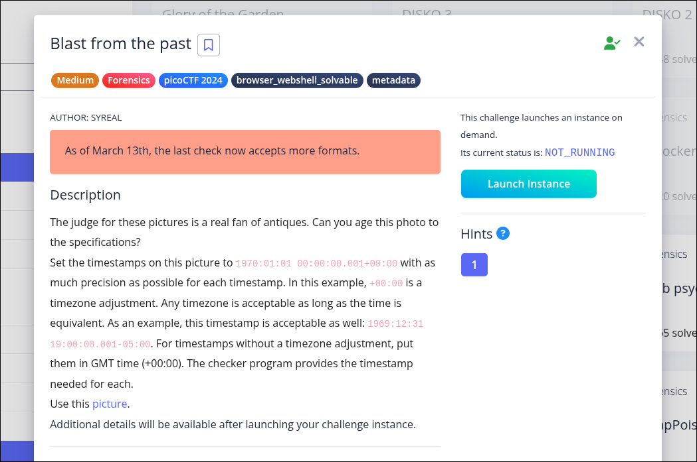
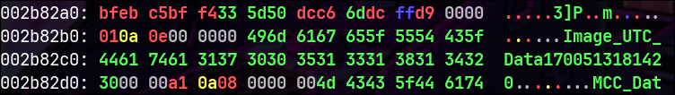
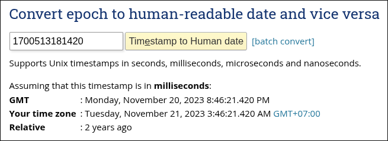

# Blast from the past (Forensics)

Author: syreal

As of March 13th, the last check now accepts more formats.

### Description

The judge for these pictures is a real fan of antiques. Can you age this photo to the specifications?
Set the timestamps on this picture to **1970:01:01 00:00:00.001+00:00** with as much precision as possible for each timestamp. 

In this example, **+00:00** is a timezone adjustment. Any timezone is acceptable as long as the time is equivalent. As an example, this timestamp is acceptable as well: **1969:12:31 19:00:00.001-05:00**. For timestamps without a timezone adjustment, put them in **GMT time (+00:00)**. 

The checker program provides the timestamp needed for each.
Use this picture.
Additional details will be available after launching your challenge instance.





- Khi vừa nhận được file ảnh tôi liền check siêu dữ liệu bằng lệnh:

```
$ exiftool original.jpg
```


- Kết quả thu được là khá nhiều mốc thời gian:


- Theo yêu cầu của đề bài là phải đặt các mốc thời gian này về giống đề bài vậy nên tôi dùng lệnh sau để đặt lại:

```
$ exiftool -AllDates='1970:01:01 00:00:00.001' -CreateDate='1970:01:01 00:00:00.001' -DateTimeOriginal='1970:01:01 00:00:00.001' -ModifyDate='1970:01:01 00:00:00.001' -SubSecCreateDate='1970:01:01 00:00:00.001' -SubSecDateTimeOriginal='1970:01:01 00:00:00.001' -SubSecModifyDate='1970:01:01 00:00:00.001' original.jpg
```


- Khi đặt lại thời gian xong tôi dùng 2 câu lệnh của đề bài để check kết quả:

Submit your modified picture here:

```
$ nc -w 2 mimas.picoctf.net 56706 < original.jpg
```

Check your modified picture here:

```
$ nc mimas.picoctf.net 58662
```


- Kết quả thu được có vẻ sai sót ở thời gian nào đó:


- Có vẻ là không khớp chuẩn thời gian, tôi check lại bằng lệnh:

```
$ xxd original.jpg
```


- Và có vẻ đã ra thủ phạm, 1 chuỗi số khá kì lạ và khả nghi:



> 1700513181420


- Tôi check thử và ồ wow nó trông giống Timestamp:




- Vậy nên tôi nghĩ nên chỉnh lại mã hex để được 1 chuỗi diff (tôi nghĩ vậy):


sửa image_utc_data thành


không phải 0, vì chúng ta cần phải đặt nó theo mili giây chứ không phải giây nên nó sẽ là 00001


- Sau đó tôi check lại bằng 2 lệnh:

```
$ nc -w 2 mimas.picoctf.net 56706 < original.jpg

$ nc mimas.picoctf.net 58662
```


- Kết quả thu được:


Vậy thôi :)))