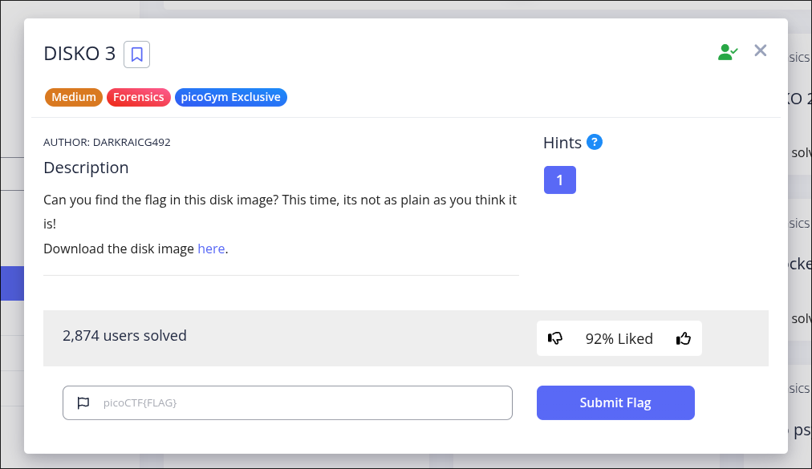
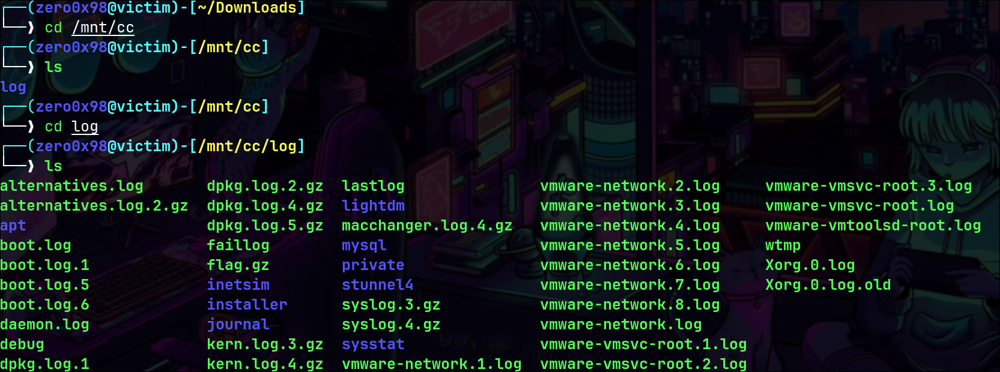

# DISKO 3 (Forensics)


Author: Darkraicg492

#### Description

Can you find the flag in this disk image? 

This time, its not as plain as you think it is!Download the disk image [here](https://artifacts.picoctf.net/c/542/disko-3.dd.gz).




Sau khi bấm vào **here** thì tôi có một file .dd.gz


Nhận định sơ qua thì đây là một file ảnh ổ đĩa trên linux 

### Các bước làm cụ thể

- #### Bước 1: 

Giải nén file **disko-3.dd.gz** bằng **gunzip** để lấy được tệp ổ đĩa

```
$ gunzip disko-3.dd.gz
```


- ### Bước 2:

Sau khi có tệp **disko-3.dd** tôi sẽ mount tạm vào **/mnt/cc** để có thể đọc được nội dung trong tệp đĩa đó

```
$ sudo mkdir /mnt/cc

$ sudo mount -o loop disko-3.dd /mnt/cc
```


Sau khi mount xong tôi vào và thấy một folder khả nghi là **flag.gz**




- #### Bước 3:

Tôi giải nén flag.gz ra và nụm cờ

```
$ sudo gunzip flag.gz
```


