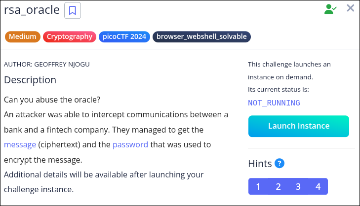
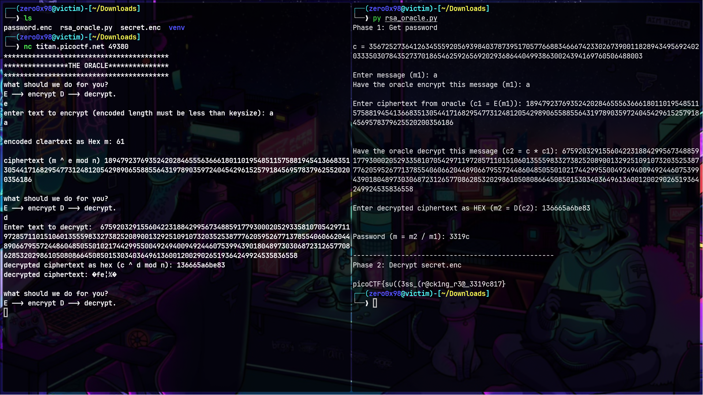

# picoCTF 2024: rsa_oracle


### Problem




### Solution

Given two files, `secret.enc` and `password.enc` (the ciphertext and encrypted password, respectively), we must first reveal the password as plaintext, then use this to decrypt the ciphertext. The contents of the files are as follows:

`secret.enc`

```
Salted__u·Ø—oÁ3aÿ„õð­&w�¥^áó&gº·Žh¦Úaõ/¨§^
J\)æ§ge0"_G
```

`password.enc`

```
3567252736412634555920569398403787395170577668834666742330267390011828943495692402033350307843527370186546259265692029368644049938630024394169760506488003
```


### Background

A few semesters ago I took a cryptography course which dealt with problems similar to this (albeit, mostly theoretical in nature).

Assuming the oracle uses textbook RSA under the hood (which is highly plausible for a question of this sort), it is susceptible to a chosen plaintext attack by leveraging its partially-homomorphic nature.

The homomorphic property is this: *E*n**c*(*m*1)×*E**n**c*(*m*2)=*E**n**c*(*m*1×*m*2) where *m**i* is plaintext *i*. For RSA in particular, it looks more like: *RS**A*(*m*1)×*RS**A*(*m*2)=*m*1*e*×*m*2*e*(mod*n*)=(*m*1×*m*2)*e*(mod*n*)=*RS**A*(*m*1×*m*2).

Suppose, for example, that we are given *c*1=*E**n**c*(*m*1) and we can choose *m*2. Then, we pass *m*2 to the encryption oracle to receive *c*2=*E**n**c*(*m*2). If we compute *c*3=*c*1×*c*2, then *c*3=*E**n**c*(*m*1)×*E**n**c*(*m*2)=*E**n**c*(*m*1×*m*2) by the homomorphic property. That also means that if we pass *c*3 to the decryption oracle, we receive *m*3=*Dec*(*c*3)=*Dec*(*E**n**c*(*m*1×*m*2))=*m*1×*m*2. But since we chose *m*2, we can easily discover *m*1 by computing *m*1=*m*2*m*3!

This is the approach we must take to decrypt the encrypted password in `password.enc`. With the password in hand, we can decrypt `secret.enc` using `openssl enc -aes-256-cbc -d -in secret.enc -pass pass:<password-goes-here>`.

Below is an interactive script that I wrote to decrypt the password and with it, the secret, for any single-character message.


### Script

```
from subprocess import run, PIPE  
  
# Grab ciphertext
with open("password.enc", "r") as f:  
	c = int(f.read())  
  
print("Phase 1: Get password\n")  
  
print(f"c = {c}\n")  
 
# Get message from user
m1 = input("Enter message (m1): ")  
m1_bytes = bytes(m1, "utf-8")  
m1_int = ord(m1_bytes) 
  
print(f"Have the oracle encrypt this message (m1): {m1}\n")  
c1 = int(input("Enter ciphertext from oracle (c1 = E(m1)): "))  
print("\n")  
 
# Exploit the homomorphic property of RSA
c2 = c * c1  
print(f"Have the oracle decrypt this message (c2 = c * c1): {c2}\n")  
  
m2 = int(input("Enter decrypted ciphertext as HEX (m2 = D(c2): "), 16)  
print("\n")  
 
# Exploit the homomorphic property of RSA some more
m_int = m2 // m1_int  
m = m_int.to_bytes(len(str(m_int)), "big").decode("utf-8").lstrip("\x00")
print(f"Password (m = m2 / m1): {m}\n")  
  
print("-" * 50)  
  
print("Phase 2: Decrypt secret.enc\n")  
 
# Decrypt the secret and print it
res = run(["openssl", "enc", "-aes-256-cbc", "-d", "-in", "secret.enc", "-pass",  
f"pass:{m}"], stdout=PIPE, stderr=PIPE, text=True)  
print(res.stdout)
```

Running this (and playing along with the oracle) goes a little something like this:

